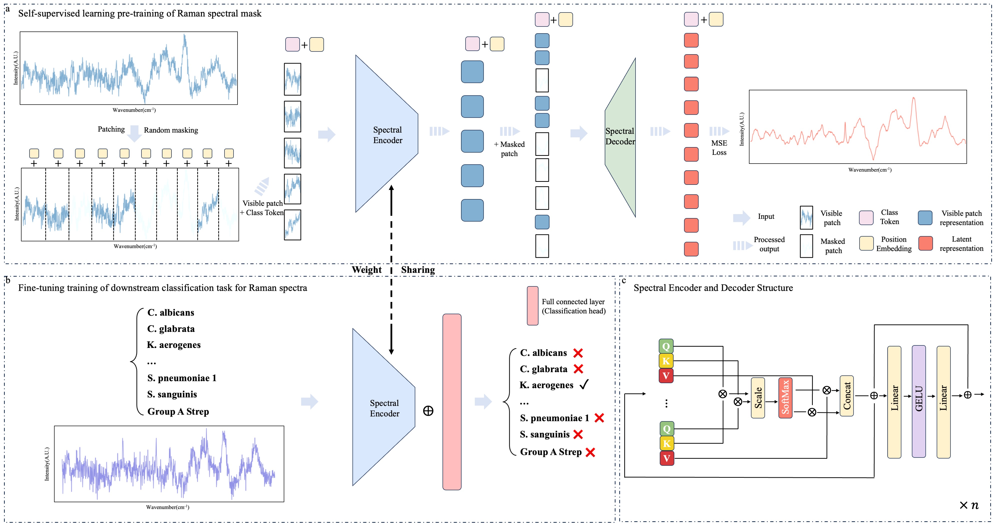

# SpectraMAENet
## About
This repository contains the code and resources of the following paper:
A spectral self-supervised learning method based on Mask AutoEncoders

## Overview of the framework
SMAE is a new self-supervised learning framework for Raman spectroscopy, which includes a transformer encoder structure and uses a masked pre-training strategy.

 

## **Setup environment**
Setup the required environment using `environment.yml` with Anaconda. While in the project directory run:

    conda env create
    
Activate the environment

    conda activate SMAE

## **Pre-train**

## Resources
Self-supervised learning uses spectral data as: Pathogen bacteria dataset [bacteria_ID](https://www.dropbox.com/scl/fo/fb29ihfnvishuxlnpgvhg/AJToUtts-vjYdwZGeqK4k-Y?rlkey=r4p070nsuei6qj3pjp13nwf6l&e=1&dl=0)

Denoising dataset: [DEEPER](https://emckclac-my.sharepoint.com/personal/k1919691_kcl_ac_uk/_layouts/15/onedrive.aspx?id=%2Fpersonal%2Fk1919691%5Fkcl%5Fac%5Fuk%2FDocuments%2FDeepeR%2FRaman%20Spectral%20Denoising%2FDataset&fromShare=true&ga=1](https://emckclac-my.sharepoint.com/:f:/g/personal/k1919691_kcl_ac_uk/EqZaY-_FrGdImybIGuMCvb8Bo_YD1Bc9ATBxbLxdDIv0RA?e=5%3aHhLp91&fromShare=true&at=9)
